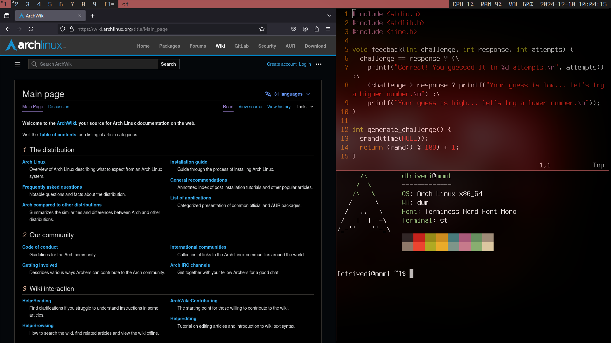

# mnml
A Minimal Arch Setup
(inspired by [ArchTitus](https://github.com/ChrisTitusTech/ArchTitus))

## Overview
mnml is a lightweight and customizable Arch setup designed for minimalism enthusiasts. Built around the [suckless](https://suckless.org) desktop philosophy, it offers an efficient and distraction-free desktop environment.

## Installation
To get started, simply run the following from the Arch installer:
`bash <(curl -L raw.githubusercontent.com/thatdhruv/mnml/HEAD/install.sh)`
